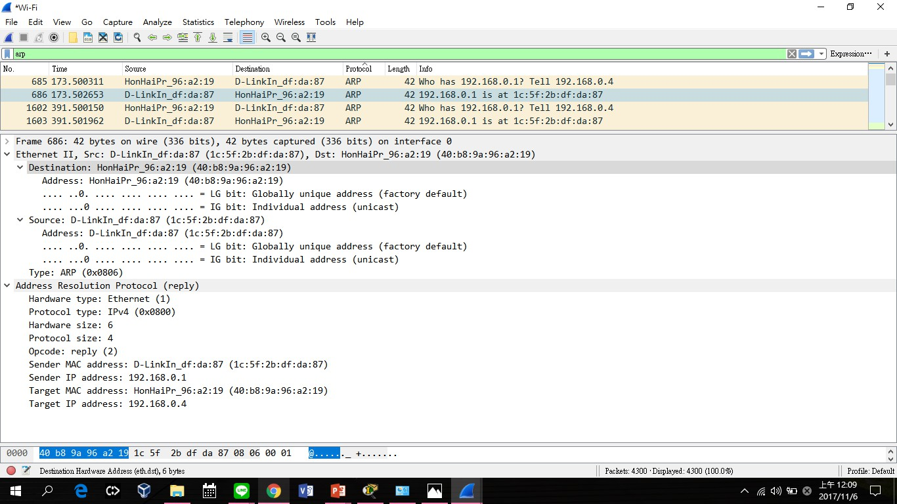

- # Part I: ARP request message

  
  - a. the hardware type : Ethernet(1)
  - b. the protocol type : IPv4 (0x0800)
  - c. the hardware length : 6 <sb>
  - d. the protocol length : 4 <sb>
  - e. the operation code : <sb>
  - f. the source hardware address.
  - g. the source protocol address?
  - h. the destination hardware address.
  - i. the destination protocol address?
  
  
- # Part II: ARP reply message

  - a. the hardware type : Ethernet(1)
  - b. the protocol type : IPv4 (0x0800)
  - c. the hardware length : 6 <sb>
  - d. the protocol length : 4 <sb>
  - e. the operation code. <sb>
  - f. the source hardware address.
  - g. the source protocol address?
  - h. the destination hardware address.
  - i. the destination protocol address?
  
  
  
 
  
