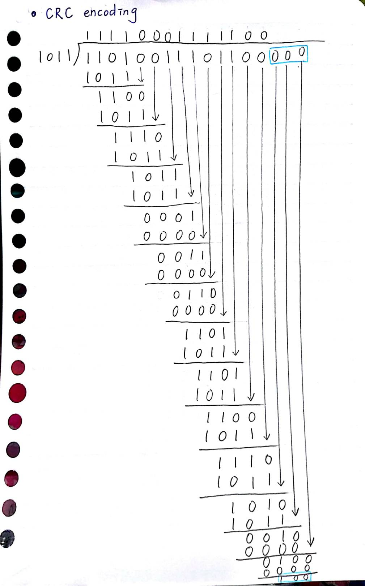
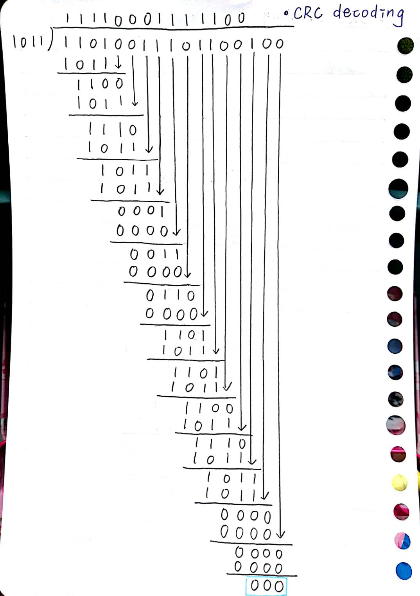
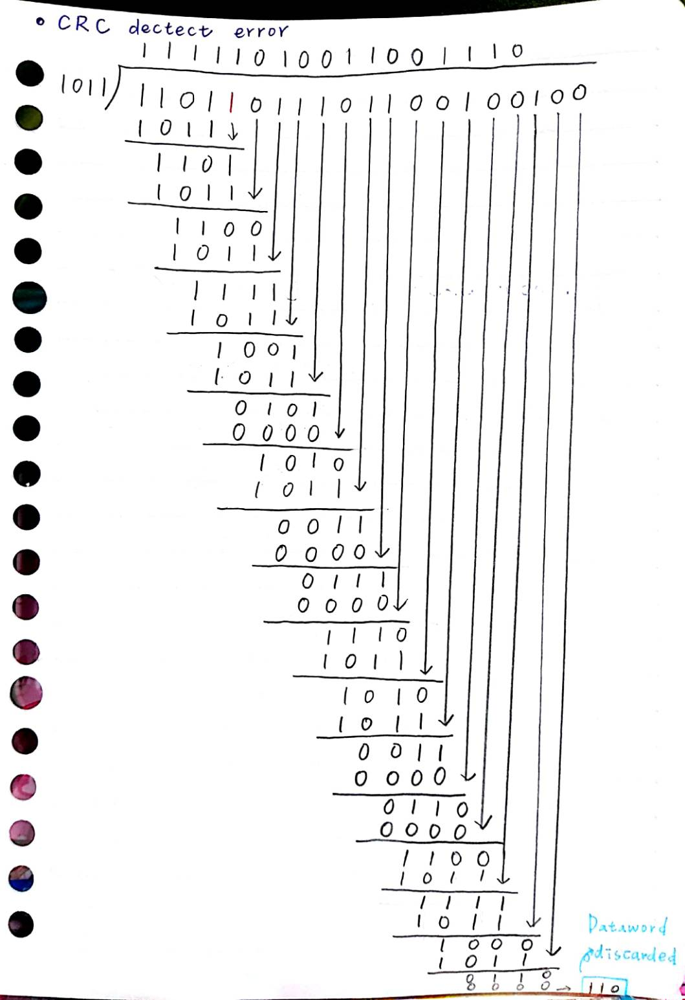

## Encode 11010011101100 in CRC code, the divisor is 1011.

- CRC encoding
  - Codeword 11010011101100100
  

- CRC decoding  
  - Dataword accepted 11010011101100
  

- CRC detect error  
  - Dataword discarded
  
