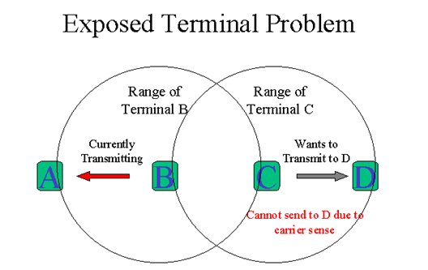

## How to solve the Exposed Terminal Problem ?
- ### Exposed Terminal Problem : 暴露節點問題

- 問題說明 :  
   C 要傳送資料給D時，發現傳輸範圍內的B正在傳送資料給A（C是B的暴露節點），C就會延遲傳送。  
   因為B傳送資料給A與C傳送資料給D並不衝突，因此這種因為聽到傳輸範圍內有節點在傳輸，  
   而延遲傳輸就是暴露節點的問題(Exposed Terminal Problem)。  
   
    
   
- 解決辦法 :  
802.11 RTS / CTS的機制，有助於解決這個問題。  
當一個節點聽到一個RTS從鄰近的節點，而不是相應的CTS，  
該節點可以推斷，這是一個裸露的節點，是允許傳輸給其他鄰近的節點。  

 

- 參考資料 :  
http://oilcut123.pixnet.net/blog/post/354490151-%5B%E6%95%B4%E7%90%86%5D-hi

